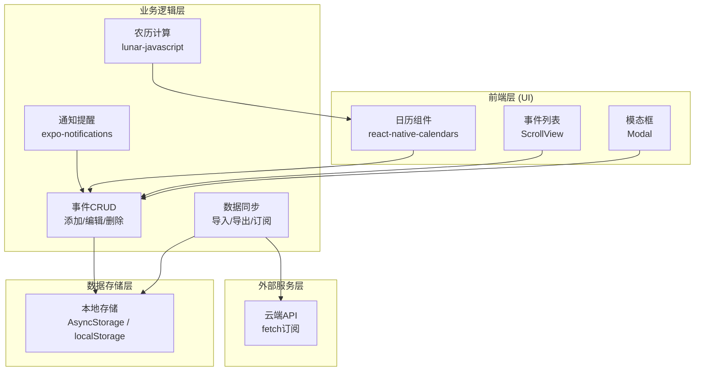

```mermaid
graph TB
    subgraph "前端层 (UI)"
        A[日历组件<br/>react-native-calendars]
        B[事件列表<br/>ScrollView]
        C[模态框<br/>Modal]
    end
    
    subgraph "业务逻辑层"
        D[事件CRUD<br/>添加/编辑/删除]
        E[数据同步<br/>导入/导出/订阅]
        F[农历计算<br/>lunar-javascript]
        G[通知提醒<br/>expo-notifications]
    end
    
    subgraph "数据存储层"
        H[本地存储<br/>AsyncStorage / localStorage]
    end
    
    subgraph "外部服务层"
        I[云端API<br/>fetch订阅]
    end
    
    A --> D
    B --> D
    C --> D
    D --> H
    E --> H
    E --> I
    F --> A
    G --> D
```