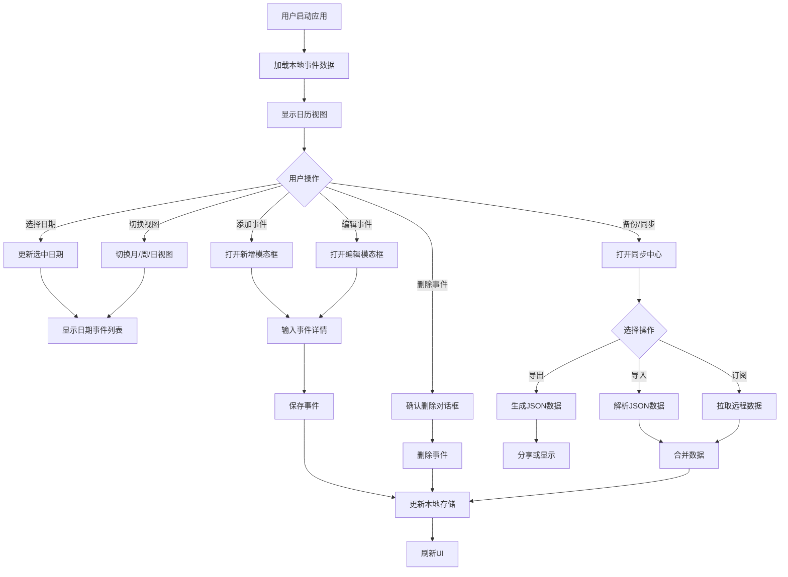

```mermaid
graph TD
    A[用户启动应用] --> B[加载本地事件数据]
    B --> C[显示日历视图]
    C --> D{用户操作}
    D -->|选择日期| E[更新选中日期]
    D -->|切换视图| F[切换月/周/日视图]
    D -->|添加事件| G[打开新增模态框]
    D -->|编辑事件| H[打开编辑模态框]
    D -->|删除事件| I[确认删除对话框]
    D -->|备份/同步| J[打开同步中心]
    E --> K[显示日期事件列表]
    F --> K
    G --> L[输入事件详情]
    H --> L
    L --> M[保存事件]
    M --> N[更新本地存储]
    N --> O[刷新UI]
    I --> P[删除事件]
    P --> N
    J --> Q{选择操作}
    Q -->|导出| R[生成JSON数据]
    Q -->|导入| S[解析JSON数据]
    Q -->|订阅| T[拉取远程数据]
    R --> U[分享或显示]
    S --> V[合并数据]
    T --> V
    V --> N
```